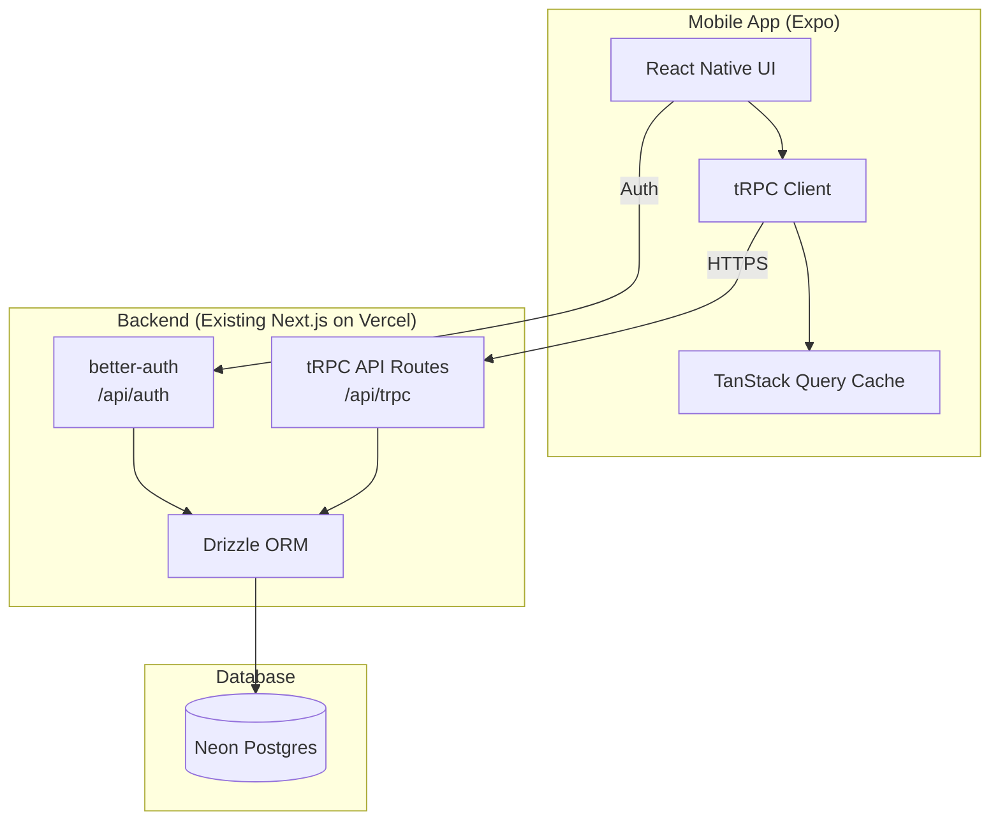

# Poultry Solution — Mobile App Implementation Plan

**Goal**: Build a React Native mobile app ("Poultry Solution") that shares the same Neon Postgres database as the existing Next.js web app, replicating all core features for mobile-first use.

---

## 📱 Existing Web App Feature Map

After a full codebase analysis of 581-line DB schema (20+ tables), 28+ tRPC routers, and 14 feature modules, here is the complete feature inventory:

### Authentication & User Management
| Feature | Web Implementation | Mobile Priority |
|---|---|---|
| Email/Password sign-up & sign-in | better-auth + drizzle | **P0 — Must Have** |
| Email verification (OTP) | better-auth emailOTP plugin | **P0** |
| Google OAuth | better-auth socialProviders | **P1 — Should Have** |
| Two-Factor Auth (2FA) | better-auth twoFactor plugin | **P2 — Nice to Have** |
| Forgot / Reset Password | Email link flow | **P0** |
| Session management | Cookie-based | JWT/token-based for mobile |

### Multi-Tenancy & Roles
| Feature | Details | Mobile Priority |
|---|---|---|
| Organization listing & joining | User requests to join; PENDING → ACTIVE | **P0** |
| Role system: OWNER / MANAGER / OFFICER | orgRoleEnum | **P0** |
| Mode switching: MANAGEMENT ↔ OFFICER | activeMode on member table | **P0** |
| Global ADMIN mode switching | USER ↔ ADMIN for super admins | **P1** |
| Access levels: VIEW / EDIT for Managers | accessLevel field | **P0** |

### 🐔 Farmer Management (Officer)
| Feature | Details | Priority |
|---|---|---|
| CRUD farmers | Name, location, mobile, org assignment | **P0** |
| View farmer list with search & pagination | ilike search, soft-delete logic | **P0** |
| Feed stock tracking (mainStock, totalConsumed) | Real-time stock | **P0** |
| Security money management | Decimal tracking with audit logs | **P1** |
| Farmer benchmark stats | FCR, mortality, avg weight from history | **P1** |
| Soft delete farmers | status = "deleted", deletedAt timestamp | **P0** |
| Restore deleted farmers | Management action to un-delete | **P1** |
| Bulk farmer import | Import multiple farmers at once | **P2** |

### 🔄 Cycle Management (Officer)
| Feature | Details | Priority |
|---|---|---|
| Create cycle | farmerId, doc count, age, birdType | **P0** |
| List active / past cycles | Paginated with search, sort by name/age/date | **P0** |
| Bulk cycle creation | Array of cycles with validation | **P1** |
| Add feed intake | Updates cycle.intake with cumulative feed schedule | **P0** |
| Record mortality | Logs in cycleLogs, updates cycle.mortality | **P0** |
| Add notes / corrections | cycleLogs with log types | **P0** |
| End/Close cycle | Archives to cycleHistory, stock deduction | **P0** |
| Reopen cycle | Move cycleHistory back to active | **P1** |
| Delete past cycle | Completely remove history record | **P2** |
| Revert log entries | isReverted flag for various logs | **P1** |
| Explicit corrections | correctDoc, correctAge, correctMortality endpoints | **P1** |
| Auto age calculation | Based on createdAt date | **P0** |
| Feed consumption calculator | CUMULATIVE_FEED_SCHEDULE (40-day schedule) | **P0** |
| Sync Feed | Re-calculate feed logic manually | **P2** |

### 💰 Sales System (Officer)
| Feature | Details | Priority |
|---|---|---|
| Create sale event | Birds sold, weight, price/kg, feed consumed/stock | **P0** |
| Sale preview | Calculates FCR, EPI, survival rate before saving | **P0** |
| Adjust existing sales | Edit with adjustment notes, report generation | **P1** |
| Sale reports (per-event) | Historical sale reports with generate schema | **P1** |
| Delete sale events | With confirmation | **P1** |
| Sale metrics | FCR, EPI, survival rate, profit calculation | **P0** |
| Multiple feed types tracking | JSON arrays for consumed/stock feeds | **P0** |
| Dynamic pricing | pricePerKg, cashReceived, depositReceived | **P0** |
| Sale adjustment versioning | setActiveVersion to switch between edits | **P1** |

### 📦 Stock Ledger (Officer)
| Feature | Details | Priority |
|---|---|---|
| View stock history per farmer | Ledger with all transactions | **P0** |
| Add stock (restock) | Positive entries with notifications | **P0** |
| Deduct stock (corrections) | Negative entries | **P0** |
| Transfer stock | Move stock between farmers | **P0** |
| Correct/Revert stock logs | edit/revert existing stock entries | **P1** |
| Bulk stock add (Pro) | Up to 50 farmers at once, driver name | **P1** |
| Stock import history | View batch import details | **P2** |
| Management view: stock summary & ledger | Org-wide stock overview | **P1** |

### 📋 Feed Orders (Pro Feature)
| Feature | Details | Priority |
|---|---|---|
| Create feed order | Multiple farmers, feed types (B1/B2), quantities | **P1** |
| List / edit / delete feed orders | CRUD with ownership validation | **P1** |
| Confirm feed order | Auto-creates stock logs, updates farmer stock | **P1** |
| Driver name capture on confirmation | driverName field | **P1** |

### 🐣 DOC (Day Old Chick) Orders (Pro Feature)
| Feature | Details | Priority |
|---|---|---|
| Create DOC order | birdType, docCount, isContract, branchName | **P1** |
| List / edit / delete DOC orders | CRUD with date validation (40-day limit) | **P1** |
| Confirm DOC order → Auto-create cycles | Creates cycles from order items | **P1** |
| Bird type management | birdTypes table, create-or-find logic | **P1** |

### 📊 Reports & Analytics
| Feature | Details | Priority |
|---|---|---|
| DOC placement report (monthly) | Grouped by farmer with totals | **P1** |
| Annual performance report (Pro) | Monthly breakdown for an officer | **P2** |
| Performance summary (custom range, Pro) | FCR, EPI, survival rate, revenue | **P2** |
| Sales summary (Management) | Org-wide sales with farmer breakdown | **P1** |
| Sales ledger (Management) | Per-farmer sale history | **P1** |
| Stock summary (Management) | Org-wide stock overview | **P1** |
| Production report with month/year selectors | Revenue, profit calculation | **P2** |

### 🔔 Notifications
| Feature | Details | Priority |
|---|---|---|
| In-app notification list | Paginated with search, types | **P0** |
| Unread count badge | Real-time count | **P0** |
| Mark as read / mark all as read | Individual + bulk | **P0** |
| Delete notifications | Per-notification | **P1** |

### 🤖 AI Features (Pro)
| Feature | Details | Priority |
|---|---|---|
| AI-powered cycle data extraction | Groq SDK, text parsing | **P2** |
| Fuzzy farmer name matching | Fuse.js with normalization | **P2** |
| Bulk import from text/image | AI extracts structured cycle data | **P2** |

### 👔 Management Dashboard
| Feature | Details | Priority |
|---|---|---|
| Org-wide cycle overview | All officers' cycles | **P1** |
| Farmer management (org-wide) | View all farmers in org | **P1** |
| Member management | Approve/reject PENDING members | **P1** |
| Officer management | View officers and their data | **P1** |
| Feed order approval view | Org-wide feed orders | **P1** |

### 🛡️ Admin Panel
| Feature | Details | Priority |
|---|---|---|
| Organization CRUD | Create, manage organizations | **P2** |
| Global user management | View all users, manage roles | **P2** |
| Global stats dashboard | Platform-wide metrics | **P2** |
| Pro feature request management | Approve/reject feature requests | **P2** |

---

## 🛠 Tech Stack Recommendations

### Option 1: **Expo + React Native** (⭐ Recommended for Next.js Devs)

```
Expo SDK 52+ / React Native 0.76+
├── Navigation:     expo-router (file-based, mirrors Next.js App Router!)
├── API Layer:      tRPC client (@trpc/client + @tanstack/react-query)
├── Database:       Same Neon Postgres (via tRPC server on existing Next.js)
├── Auth:           better-auth React Native client
├── UI Kit:         React Native Paper / NativeWind (Tailwind for RN)
├── Forms:          react-hook-form + zod (same as web!)
├── State:          TanStack Query (same as web!) + zustand for local
├── Charts:         react-native-chart-kit / victory-native
├── Icons:          @expo/vector-icons
├── Notifications:  expo-notifications (push) + in-app
└── Build:          EAS Build & Submit
```

> [!IMPORTANT]
> **Why this is best for you**: expo-router uses the **same file-based routing** as Next.js App Router. You already know `react-hook-form`, `zod`, `@tanstack/react-query`, and `tRPC` — these all work identically in React Native. The learning curve is mostly just replacing web HTML elements with RN components (`<View>`, `<Text>`, `<Pressable>`).

### Option 2: **Expo + NativeWind** (Most Familiar Styling)

Same as Option 1, but with:
- **NativeWind v4**: Brings Tailwind CSS to React Native — write `className="bg-blue-500 p-4 rounded-lg"` just like your Next.js app. Supports Tailwind CSS v4.
- Near-zero styling learning curve.

### Option 3: **Expo + Tamagui** (Best Performance + Design System)

Same as Option 1, but with:
- **Tamagui**: Optimizing compiler for RN + web, excellent performance
- Built-in design tokens, themes, responsive styles
- Steeper learning curve but production-grade component library

### ❌ NOT Recommended
| Tech | Why Not |
|---|---|
| Flutter | Dart language, can't reuse any JS/TS code or tRPC |
| Ionic/Capacitor | WebView-based, poor native feel |
| Raw React Native CLI | Much more setup vs Expo, no file-based routing |

---

## Architecture: How Mobile Connects to Same Database



> [!NOTE]
> **No separate backend needed!** The mobile app calls the **same tRPC endpoints** on your existing Next.js server. The only backend change needed is adding mobile token-based auth support to `better-auth` (the `bearer` plugin or similar).

---

## 🚀 Solo Developer Production Roadmap

This roadmap is designed for a solo developer to build, test, and ship "Poultry Solution" while maintaining high quality and a clean state to resume from at any point.

---

### Phase 0: Foundation & Connectivity (The "Pulse")
> **Goal**: Establish the link between Mobile and existing Backend.
- [x] **PNP-0.1**: Initial Expo Repo with `expo-router` (Tabs + Stack structure). [done]
- [x] **PNP-0.2**: Shared UI Library Setup (NativeWind/Tailwind v4) [done]
- [x] **PNP-0.3**: API Layer: Port `tRPC` client and `TanStack Query` config. [done]
- [x] **PNP-0.4**: Backend Auth Support: Add `bearer` plugin to `better-auth`. [done]
- [x] **PNP-0.5**: Auth Screens: Sign In, Verification OTP, and Session persistence.[done]
- [x] **Milestone**: "I can log in on my phone and the app recognizes who I am." [reached]

---

### Phase 1: Officer Core - Day-to-Day Operations
> **Goal**: The most critical loop for on-the-ground work.
- [x] **PNP-1.1**: Farmer Directory: List view with search and "Active Only" filters. [done]
- [x] **PNP-1.2**: Farmer Detail Page: Quick stats overview (Stock, Total Consumed). [done]
- [x] **PNP-1.3**: Cycle Browser: List all active batches with age/mortality badges. [done]
- [x] **PNP-1.4**: Production Logging: Simple forms for daily Feed Intake & Mortality. [done]
- [x] **PNP-1.5**: Cycle Audit Logs: List view of all `cycleLogs` (Notes, Corrections). [done]
- [x] **PNP-1.6**: Explicit Corrections & Sync: Correct DOC, Age, Mortality via specific modals, and manually sync feed. [done]
- [x] **Milestone**: "Officers can record daily data without opening their laptops." [reached]

---

### Phase 2: Sales, Financials & Archive
> **Goal**: Closing the loop on batch production.
- [X] **PNP-2.1**: Sales Entry: Multi-step form for birds sold, weight, and pricing.[done]
- [X] **PNP-2.2**: Sales Preview: Real-time FCR/EPI calculation *before* submission.[done]
- [X] **PNP-2.3**: Cycle Closure: "Close Batch" flow with stock reconciliation.[done]
- [X] **PNP-2.4**: Historical Browser: Searchable list of `cycleHistory`.[done]
- [X] **PNP-2.5**: Cycle Archive Management: Allow reopening closed cycles and completely deleting past cycle records.[done]
- [X] **PNP-2.6**: Sale Adjustments & Versioning: Edit existing sales and switch between versions (`setActiveVersion`).[done]
- [X] **Milestone**: "A batch can be started, tracked, and sold entirely from mobile."[reached]

---

### Phase 3: Inventory & Ledger Control
> **Goal**: Managing the physical assets (Feed Stock).
- [X] **PNP-3.1**: Stock Ledger: Filterable list of all stock transactions per farmer.[done]
- [X] **PNP-3.2**: Manual Restock: "Add Stock" modal for driver deliveries.[done]
- [X] **PNP-3.3**: Correction Logs: "Deduct Stock" for wastage or error corrections.[done]
- [X] **PNP-3.4**: Transfer Stock: Move stock directly between farmers.[done]
- [X] **PNP-3.5**: Security Money Trace: View/Update security deposit logs.[done]
- [X] **PNP-3.6**: Correct/Revert Stock Logs: Edit or revert existing stock entries.[done]
- [X] **Milestone**: "Farmer stock balances are always in sync with the physical warehouse."[reached]

---

### Phase 4: Pro Systems - Orders & Automation
> **Goal**: Scaling operations with advanced tools.
- [ ] **PNP-4.1**: Feed Orders: Create/Confirm multi-farmer orders.
- [ ] **PNP-4.2**: DOC Orders: Tracking placements and auto-creating cycles.
- [ ] **PNP-4.3**: Bulk Actions: Bulk Stock Restock, Bulk Farmer Import (Pro features).
- [ ] **PNP-4.4**: AI Data Extraction: Import cycle data from text/voice notes (Experimental).
- [ ] **PNP-4.5**: Stock Import History: View details of bulk stock imports.
- [ ] **Milestone**: "Large-scale logistics (Feed/Chicks) are managed directly from the field."

---

### Phase 5: Management Intelligence & Reports
> **Goal**: High-level visibility for Owners/Managers.
- [ ] **PNP-5.1**: Performance Dashboards: Monthly/Annual officer benchmarks.
- [ ] **PNP-5.2**: Org Oversight: Management view of all officer cycles/farmers.
- [ ] **PNP-5.3**: Member Approval: Approve/Reject new staff join requests.
- [ ] **PNP-5.4**: Farmer Restoration: Management action to un-delete (restore) soft-deleted farmers.
- [ ] **PNP-5.5**: PDF Export: Generating placement/production reports from mobile.
- [ ] **Milestone**: "The Owner has a birds-eye view of the entire organization."

---

### Phase 6: Production Polish & Launch
> **Goal**: Making it "Production Level."
- [ ] **PNP-6.1**: Push Notifications: Alerts for restocks, sales, and confirmations.
- [ ] **PNP-6.2**: Offline Resilience: Optimistic updates and local caching for low-signal areas.
- [ ] **PNP-6.3**: Performance: Smooth animations and lazy-loading for large lists.
- [ ] **PNP-6.4**: Launch Prep: App Store icons, splash screens, and Play Store logic.
- [ ] **Milestone**: "The app is live on stores and feels like a premium product."

---

## Backend Changes Required

### 1. Auth: Add Bearer Token Support
The existing `better-auth` uses cookies (web-only). For mobile, add the **bearer plugin**:

```diff
// lib/auth.ts
+ import { bearer } from "better-auth/plugins"

export const auth = betterAuth({
  plugins: [
    organization(),
    twoFactor({...}),
    emailOTP({...}),
+   bearer()  // Enables Authorization: Bearer <token> for mobile
  ],
+ trustedOrigins: [
+   ...existing,
+   "exp://localhost:8081",  // Expo dev
+   "poultrysolution://"     // Mobile deep link scheme
+ ]
})
```

### 2. tRPC Context: Support Bearer Auth
Update `trpc/init.ts` to extract tokens from Authorization header when cookies aren't present (mobile).

### 3. Add CORS Headers
If the mobile app calls a different origin, ensure `/api/trpc` and `/api/auth` return appropriate CORS headers.

---

## Verification Plan

Since this is a **planning document** for a new mobile app (no code changes to existing codebase yet), verification will happen during execution:

### Automated Tests
- After each phase, run the existing Next.js dev server and test tRPC endpoints via the mobile app
- Verify database operations work identically to web

### Manual Testing
- **Auth flow**: Sign up from mobile → verify email → sign in → confirm session valid
- **Data integrity**: Create farmer on mobile → verify visible on web → edit on web → verify updated on mobile
- **Role switching**: Test officer/management mode toggle on mobile
- **Offline resilience**: TanStack Query cache behavior when network drops

---

## Key Reusable Code from Web

| Web Code | Reusable in Mobile? |
|---|---|
| `db/schema.ts` | ❌ Server-only, mobile uses via tRPC |
| `trpc/routers/*` | ❌ Server-only, mobile is a client |
| `constants.ts` | ✅ Copy feed schedule, pricing constants |
| Zod schemas in routers | ✅ Extract shared schemas to a package |
| `modules/*/server/services/*` | ❌ Server-only |
| tRPC client setup pattern | ✅ Adapt for React Native |
| react-hook-form patterns | ✅ Nearly identical in RN |
| TanStack Query patterns | ✅ Identical usage |
